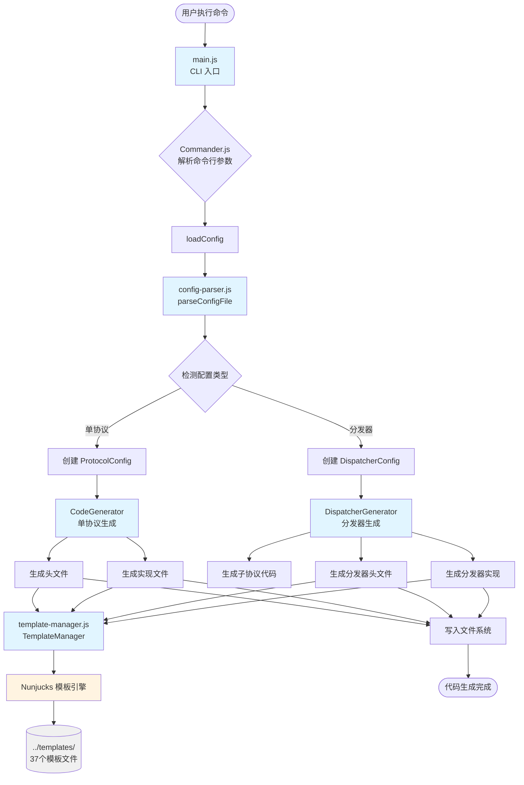
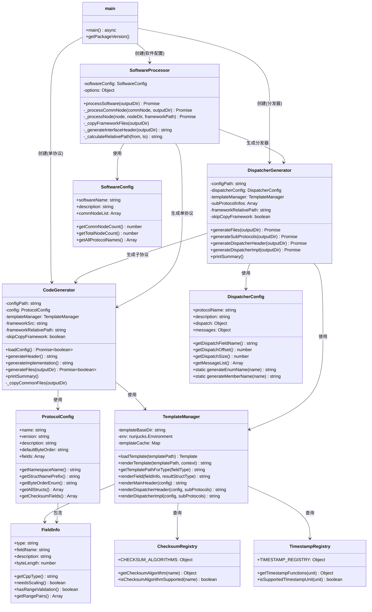

# Protocol Code Generator - Node.js Implementation

基于 Node.js 的协议解析与序列化代码生成器，从 JSON 配置文件自动生成高性能的 C++ 协议解析和序列化代码。

## 特性

- **数据驱动**: 通过 JSON 配置驱动代码生成，无需手写解析和序列化逻辑
- **双向转换**: 同时支持解析（二进制→结构体）和序列化（结构体→二进制）
- **高性能**: 生成的 C++ 代码采用直接函数调用，零分配，编译器友好，易于优化
- **类型安全**: 完整的 C++ 类型系统，编译期检查
- **零依赖**: 生成的 C++ 代码仅依赖标准库
- **智能指针多态**: 分发器使用 `std::shared_ptr<MessageBase>` 实现类型安全的多态存储
- **多层级架构**: 支持软件→通信节点→图元→协议的多层级配置结构
- **易维护**: 模板化设计，修改模板即可批量更新生成代码

## 支持的配置类型

系统支持三种配置格式，自动检测并处理：

| 配置类型 | 适用场景 | 顶层字段特征 |
|---------|---------|------------|
| **单协议配置** | 单一固定格式的协议 | `name`, `fields` |
| **分发器配置** | 多种报文类型的协议簇 | `protocolName`, `dispatch`, `messages` |
| **软件配置** | 完整软件系统，多层级结构 | `softwareName`, `commNodeList` |

## 快速开始

### 安装依赖

```bash
cd nodegen
npm install
```

### 1. 单协议配置

适用于单一固定格式的协议：

```bash
# 从配置文件生成C++代码
node main.js ../tests/configs/test_unsigned_int.json -o ../tests/generated/unsigned_int

# 查看配置摘要
node main.js ../tests/configs/test_unsigned_int.json -s
```

### 2. 分发器配置

适用于一个连接上传输多种报文类型的场景：

```bash
# 生成分发器代码
node main.js ../tests/configs/dispatcher_test2/iot_dispatcher.json -o ../tests/generated/dispatcher2

# 查看帮助信息
node main.js --help
```

### 3. 软件配置（多层级）

适用于完整软件系统，支持多通信节点、多图元、多协议的复杂场景：

```bash
# 生成完整软件代码
node main.js ../tests/configs/test_software.json -o ../tests/generated/software_test
```

**软件配置输出结构**：
```
output/{softwareName}/
├── protocol_parser_framework/        # 共享框架头文件
├── {softwareName}_interface.h        # 软件级接口聚合文件
├── {commNodeId}/                     # 通信节点目录
│   └── {nodeId}/                     # 图元目录
│       ├── xxx_parser.h/cpp          # single 模式
│       └── xxx_dispatcher.h/cpp      # multiple 模式
```

## 命令行选项

| 选项 | 描述 | 默认值 |
|------|------|--------|
| `<config-file>` | JSON 配置文件路径（必需） | - |
| `-o, --output <dir>` | 输出目录路径 | `./generated_code` |
| `-j, --json <json-string>` | JSON 配置字符串（使用 "-" 从标准输入读取） | - |
| `-s, --summary-only` | 仅显示配置摘要，不生成文件 | `false` |
| `-v, --verbose` | 显示详细信息 | `false` |
| `--log-output <mode>` | 日志输出模式：`console`（控制台）、`file`（文件）、`both`（两者） | `console` |
| `--log-file <path>` | 日志文件路径（当 `log-output=file` 或 `both` 时生效） | `nodegen.log` |
| `--log-level <level>` | 日志级别（预留选项）：`error`、`warn`、`info`、`debug` | `info` |
| `--template-dir <dir>` | 覆盖默认模板目录 | `../templates` |
| `--framework-src <path>` | 覆盖默认框架头文件路径（需指向具体文件） | `../protocol_parser_framework/protocol_common.h` |
| `--language <lang>` | 目标语言标准（cpp11, python） | `cpp11` |
| `--platform <platform>` | 目标平台（目前仅支持 linux-x86_64） | `linux-x86_64` |
| `--cpp-sdk` | 生成 C++ SDK | `true` |
| `--no-cpp-sdk` | 禁用 C++ SDK 生成（暂不支持） | - |
| `-V, --version` | 显示版本号 | - |
| `-h, --help` | 显示帮助信息 | - |

## 日志配置

系统提供灵活的日志输出配置，支持将日志输出到控制台、文件或同时输出到两者。

### 日志输出模式

**控制台输出（默认）**
```bash
# 默认情况下，日志输出到控制台
node main.js config.json -o ./output
```

**文件输出**
```bash
# 将日志输出到文件
node main.js config.json -o ./output --log-output file --log-file ./logs/codegen.log
```

**同时输出到控制台和文件**
```bash
# 在 CI/CD 环境中，可能需要同时输出到控制台（用于实时查看）和文件（用于归档）
node main.js config.json -o ./output --log-output both --log-file ./logs/codegen.log
```

### 日志文件格式

日志文件采用结构化格式，每行包含时间戳、日志级别和消息内容：

```
[2025-12-12T04:14:18.687Z] [INFO] Protocol Code Generation System
[2025-12-12T04:14:18.689Z] [INFO] Loading configuration file...
[2025-12-12T04:14:18.711Z] [INFO] Configuration loaded successfully
```

### 使用场景

| 场景 | 推荐配置 | 说明 |
|------|---------|------|
| **本地开发** | `--log-output console` | 默认配置，实时查看输出 |
| **CI/CD 流水线** | `--log-output both` | 同时输出到控制台和文件，便于调试和归档 |
| **批量生成** | `--log-output file` | 减少控制台干扰，所有日志存档到文件 |
| **定期任务** | `--log-output file --log-file ./logs/$(date +%Y%m%d).log` | 按日期归档日志文件 |

## 协议分发器 (Protocol Dispatcher)

### 概述

协议分发器用于处理一个连接上可能接收多种不同类型报文的场景。通过在报文中提取 MessageID 字段，分发器能够自动选择对应的协议解析器进行解析。

**适用场景**：
- 一个连接上传输多种报文类型
- 每种报文类型由固定位置的 MessageID 标识
- 需要根据 MessageID 自动路由到不同的解析逻辑

### 与单协议配置的区别

| 特性 | 单协议配置 | 分发器配置 |
|------|-----------|-----------|
| **配置文件** | 定义具体字段结构 (`fields` 数组) | 定义分发规则和子协议映射 |
| **生成文件** | 1个 .h + 1个 .cpp | 1个分发器 + N个子协议解析器 |
| **顶层对象** | `name`, `fields`, `defaultByteOrder` 等 | `protocolName`, `dispatch`, `messages` |
| **使用场景** | 单一固定格式的协议 | 多种报文类型的协议簇 |
| **多态存储** | 直接结构体 | `std::shared_ptr<MessageBase>` 智能指针 |

### 分发器配置格式

分发器配置文件包含以下字段：

```json
{
  "protocolName": "IotProtocol",
  "description": "IoT设备通信协议分发器",
  "dispatch": {
    "field": "messageId",
    "type": "UnsignedInt",
    "byteOrder": "big",
    "offset": 6,
    "size": 2
  },
  "messages": {
    "0x0100": "./sensor_data.json",
    "0x0101": "./device_status.json",
    "0x0102": "./config_update.json"
  }
}
```

**字段说明**：

- `protocolName`: 分发器名称（必填）
- `description`: 分发器描述（可选）
- `dispatch`: 分发字段定义（必填）
  - `field`: MessageID 字段名称
  - `type`: 字段类型（`UnsignedInt` 或 `SignedInt`）
  - `byteOrder`: 字节序（`big` 或 `little`）
  - `offset`: MessageID 在报文中的起始偏移（字节）
  - `size`: MessageID 字段大小（字节，必须是 1/2/4/8）
- `messages`: MessageID 到子协议配置的映射（必填）
  - Key: MessageID 的十六进制或十进制字符串
  - Value: 子协议配置文件路径（相对于分发器配置文件）

### 使用示例

#### 1. 生成分发器代码

```bash
# 使用分发器配置文件生成代码
node main.js ../tests/configs/dispatcher_test2/iot_dispatcher.json -o ../tests/generated/dispatcher2

# 查看分发器配置摘要
node main.js ../tests/configs/dispatcher_test2/iot_dispatcher.json --summary-only
```

#### 2. 生成的文件结构

```
output/
├── iotprotocol_dispatcher.h           # 分发器头文件
├── iotprotocol_dispatcher.cpp         # 分发器实现文件
├── sensordata_parser.h                # 子协议1 头文件
├── sensordata_parser.cpp              # 子协议1 实现文件
├── devicestatus_parser.h              # 子协议2 头文件
├── devicestatus_parser.cpp            # 子协议2 实现文件
├── configupdate_parser.h              # 子协议3 头文件
├── configupdate_parser.cpp            # 子协议3 实现文件
└── protocol_parser_framework/
    └── protocol_common.h              # 公共框架头文件
```

#### 3. 使用生成的分发器

```cpp
#include "iotprotocol_dispatcher.h"
#include <iostream>

int main() {
    // 示例报文：SensorData (MessageID = 0x0100)
    uint8_t data[] = {
        0x55, 0xAA, 0x55, 0xAA,  // syncWord (4字节)
        0x00, 0x1C,              // packetLength (2字节)
        0x01, 0x00,              // MessageID = 0x0100 at offset 6
        // ... 后续字段数据 ...
    };

    protocol_parser::IotProtocolDispatcherResult result;
    auto parse_result = protocol_parser::deserialize_IotProtocolDispatcher(
        data, sizeof(data), result
    );

    if (parse_result.is_success()) {
        // 根据报文类型处理
        switch (result.messageType) {
            case protocol_parser::MSG_SENSOR_DATA: {
                // 使用 as<T>() 类型安全访问
                auto sensor = result.as<protocol_parser::SensorDataResult>();
                std::cout << "收到传感器数据" << std::endl;
                std::cout << "温度: " << sensor->temperature << std::endl;
                std::cout << "气压: " << sensor->pressure << std::endl;
                break;
            }

            case protocol_parser::MSG_DEVICE_STATUS: {
                auto status = result.as<protocol_parser::DeviceStatusResult>();
                std::cout << "收到设备状态" << std::endl;
                std::cout << "电量: " << (int)status->batteryLevel << "%" << std::endl;
                break;
            }

            case protocol_parser::MSG_CONFIG_UPDATE: {
                auto config = result.as<protocol_parser::ConfigUpdateResult>();
                std::cout << "收到配置更新" << std::endl;
                std::cout << "采样间隔: " << config->samplingInterval << "ms" << std::endl;
                break;
            }

            default:
                std::cout << "未知报文类型" << std::endl;
        }
    } else {
        std::cerr << "解析失败: " << parse_result.error_message << std::endl;
    }

    return 0;
}
```

#### 4. 序列化示例

```cpp
#include "iotprotocol_dispatcher.h"

int main() {
    // 创建分发器结果并设置数据
    protocol_parser::IotProtocolDispatcherResult data;
    data.messageType = protocol_parser::MSG_SENSOR_DATA;
    data.messageId = 256;  // 0x0100
    
    // 使用智能指针创建子协议数据
    auto sensorData = std::make_shared<protocol_parser::SensorDataResult>();
    sensorData->syncWord = 0x55AA55AA;
    sensorData->packetLength = 28;
    sensorData->messageId = 256;
    sensorData->sensorId = 1001;
    sensorData->temperature = 25.5f;
    sensorData->pressure = 101.3f;
    sensorData->timestamp = 1700000000000ULL;
    data.data = sensorData;  // 智能指针赋值

    // 序列化
    uint8_t buffer[256];
    auto ser_result = protocol_parser::serialize_IotProtocolDispatcher(
        data, buffer, sizeof(buffer)
    );

    if (ser_result.is_success()) {
        std::cout << "序列化成功，字节数: " << ser_result.bytes_written << std::endl;
    }

    return 0;
}
```

### 分发器架构

分发器使用智能指针多态实现类型安全的多协议路由：

```cpp
// 分发器结果结构体
struct IotProtocolDispatcherResult {
    IotProtocolMessageType messageType;  // 报文类型枚举
    uint16_t messageId;                  // 原始 MessageID 值
    
    // 智能指针多态存储（核心设计）
    std::shared_ptr<MessageBase> data;
    
    // 类型安全的访问器
    template<typename T> T* as() { 
        return static_cast<T*>(data.get()); 
    }
    
    template<typename T> std::shared_ptr<T> asShared() const {
        return std::static_pointer_cast<T>(data);
    }
    
    bool hasData() const { 
        return data != nullptr; 
    }
};
```

**优势**:
- 自动生命周期管理（无需手动释放）
- 类型安全（编译期检查）
- 支持 C++11 标准
- 无 union 的对齐和析构问题

### 测试示例

完整的分发器测试示例位于 `../tests/configs/` 目录：

```bash
# 分发器1 (offset=0)
cd tests/configs/dispatcher_test

# 分发器2 (offset=6)
cd tests/configs/dispatcher_test2
```

### 设计原则

分发器功能遵循以下设计原则：

1. **数据结构优先**: 通过主配置文件明确表达协议簇关系，而不是用标志位猜测
2. **消除特殊情况**: 在工具链层面区分单协议和分发器，而不是在生成代码中用 if/else
3. **保持简洁**: 现有的单协议生成器保持纯粹，新功能通过新模块实现
4. **向后兼容**: 所有现有的单协议配置继续工作，不破坏任何行为
5. **智能指针多态**: 使用 `std::shared_ptr<MessageBase>` 避免 union 的各种问题

### 分发器配置分析器

当你有多个单协议配置文件，需要自动生成分发器配置时，可以使用 `dispatcher-analyzer.js` 工具。

**功能**：
- 分析多个单协议 JSON，自动提取 MessageId 字段信息
- 计算 MessageId 的 offset（字节偏移量）和 size（字节长度）
- 验证所有协议的 MessageId 配置是否一致
- 自动生成分发器的 `dispatch` 和 `messages` 配置

**使用方法**：

```javascript
import { analyzeProtocolsForDispatcher } from './dispatcher-analyzer.js';

// 输入多个单协议配置对象
const protocols = [
    { name: "Protocol1", fields: [...], ... },
    { name: "Protocol2", fields: [...], ... },
    { name: "Protocol3", fields: [...], ... }
];

// 分析并生成分发器配置
const result = analyzeProtocolsForDispatcher(protocols);

console.log(result);
// {
//     dispatch: { field: "messageId", type: "UnsignedInt", byteOrder: "big", offset: 6, size: 2 },
//     messages: { "256": {...}, "257": {...}, "258": {...} },
//     status: "1",       // "1" = 成功, "2" = 错误
//     error_messages: "" // 错误信息
// }
```

**返回结果**：

| 字段 | 类型 | 说明 |
|------|------|------|
| `dispatch` | object | 分发字段配置（field, type, byteOrder, offset, size） |
| `messages` | object | MessageId 值到协议配置的映射 |
| `status` | string | "1" 表示成功，"2" 表示出现错误 |
| `error_messages` | string | 错误或警告信息 |

**注意事项**：
- 所有协议的 MessageId 字段必须在相同的 offset 位置且 size 一致
- 每个协议必须包含一个 `type: "MessageId"` 的字段
- MessageId 字段必须设置 `messageIdValue` 属性
- 此工具是独立的辅助模块，不集成在主代码生成流程中

## 项目结构

```
nodegen/
├── main.js                       # CLI 入口，命令行参数解析，自动检测配置类型
├── code-generator.js             # 单协议生成器，整合文件生成流程
├── cpp-header-generator.js       # C++ 头文件生成逻辑
├── cpp-impl-generator.js         # C++ 实现文件生成逻辑
├── cpp-serializer-generator.js   # 序列化代码生成器
├── dispatcher-generator.js       # 分发器生成器（智能指针多态架构）
├── dispatcher-analyzer.js        # 分发器配置分析器（从多个单协议自动生成dispatcher配置）
├── software-processor.js         # 软件配置处理器（多层级结构）
├── config-parser.js              # JSON 配置解析，ProtocolConfig、DispatcherConfig 和 SoftwareConfig 类
├── template-manager.js           # Nunjucks 模板管理和渲染
├── checksum_registry.js          # 校验算法注册表（支持 sum/xor/crc 系列）
├── timestamp-registry.js         # 时间戳单位转换注册表
├── package.json                  # npm 项目配置
├── package-lock.json             # npm 依赖锁定
├── README.md                     # 本文件
└── node_modules/                 # npm 依赖包（被 .gitignore 忽略）
```

## 技术栈

- **运行环境**: Node.js >= 18.17 或 >= 20.0 (需要 ES Module 支持)
- **模板引擎**: [Nunjucks](https://mozilla.github.io/nunjucks/) 3.2+ (与 Jinja2 语法兼容)
- **CLI 框架**: [Commander.js](https://github.com/tj/commander.js) 12.0+ (命令行参数解析)
- **JSON 验证**: [Ajv](https://ajv.js.org/) 8.12+ (JSON Schema 验证)
- **文件操作**: Node.js `fs/promises` (异步文件 I/O)
- **模块系统**: ES Module (import/export)

## 代码调用链

### 整体架构流程图



### 核心类关系图



## 生成流程

```
1. 解析 JSON 配置
   └─> config-parser.js 读取并验证配置文件
   └─> 自动检测：单协议 / 分发器 / 软件配置

2. 单协议模式:
   └─> code-generator.js 生成代码
       ├─> cpp-header-generator.js 生成头文件 (.h)
       ├─> cpp-impl-generator.js 生成解析实现 (.cpp)
       └─> cpp-serializer-generator.js 生成序列化实现

3. 分发器模式:
   └─> dispatcher-generator.js 生成代码
       ├─> 遍历 messages，为每个子协议调用 CodeGenerator
       ├─> 生成分发器头文件（智能指针多态结构）
       └─> 生成分发器实现（switch-case 路由）

4. 软件配置模式:
   └─> software-processor.js 处理多层级结构
       ├─> 遍历 commNodeList (通信节点列表)
       ├─> 遍历每个通信节点的 nodeList (图元列表)
       ├─> 根据 dispatch.mode 判断:
       │   ├─> "single": 调用 CodeGenerator 生成单协议
       │   └─> "multiple": 调用 DispatcherGenerator 生成分发器
       ├─> 复制框架文件到软件根目录（共享）
       └─> 生成软件级接口头文件（聚合所有协议）

5. 输出文件
   单协议:
   ├─> <protocol>_parser.h
   ├─> <protocol>_parser.cpp
   └─> protocol_parser_framework/

   分发器:
   ├─> <dispatcher>_dispatcher.h
   ├─> <dispatcher>_dispatcher.cpp
   ├─> <sub1>_parser.h/cpp
   ├─> <sub2>_parser.h/cpp
   └─> protocol_parser_framework/

   软件配置:
   output/{softwareName}/
   ├─> protocol_parser_framework/        # 共享框架
   ├─> {softwareName}_interface.h        # 软件级接口
   ├─> {commNodeId}/
   │   └─> {nodeId}/
   │       ├─> xxx_parser.h/cpp          # single 模式
   │       └─> xxx_dispatcher.h/cpp      # multiple 模式
```

## 支持的数据类型

### 基础类型

| 类型 | 描述 | 解析模板 | 序列化模板 |
|------|------|---------|----------|
| `UnsignedInt` | 无符号整数 (1/2/4/8 字节) | `primitives/unsigned_int.cpp.template` | `primitives/unsigned_int_serialize.cpp.template` |
| `SignedInt` | 有符号整数 (1/2/4/8 字节) | `primitives/signed_int.cpp.template` | `primitives/signed_int_serialize.cpp.template` |
| `MessageId` | 报文标识 (1/2/4/8 字节) | `primitives/message_id.cpp.template` | `primitives/message_id_serialize.cpp.template` |
| `Float` | 浮点数 (4/8 字节) | `primitives/float.cpp.template` | `primitives/float_serialize.cpp.template` |
| `Bcd` | BCD 编码 | `primitives/bcd.cpp.template` | `primitives/bcd_serialize.cpp.template` |
| `Timestamp` | 时间戳（支持多种单位） | `primitives/timestamp.cpp.template` | `primitives/timestamp_serialize.cpp.template` |
| `String` | 字符串 (定长/变长) | `primitives/string.cpp.template` | `primitives/string_serialize.cpp.template` |
| `Padding` | 填充字段 | `primitives/padding.cpp.template` | `primitives/padding_serialize.cpp.template` |
| `Reserved` | 保留字段（Padding 别名） | `primitives/padding.cpp.template` | `primitives/padding_serialize.cpp.template` |
| `Checksum` | 校验和（sum/xor/crc） | `primitives/checksum.cpp.template` | `primitives/checksum_serialize.cpp.template` |

### 复合类型

| 类型 | 描述 | 解析模板 | 序列化模板 |
|------|------|---------|----------|
| `Bitfield` | 位域 | `composites/bitfield.cpp.template` | `composites/bitfield_serialize.cpp.template` |
| `Encode` | 编码映射 | `composites/encode.cpp.template` | `composites/encode_serialize.cpp.template` |
| `Bytes` | 编码映射（Encode 别名） | `composites/encode.cpp.template` | `composites/encode_serialize.cpp.template` |
| `Struct` | 嵌套结构体 | `composites/struct_call.cpp.template` | `composites/struct_call_serialize.cpp.template` |
| `Array` | 数组 (固定/动态长度) | `composites/array_inline.cpp.template` | `composites/array_serialize_inline.cpp.template` |
| `Command` | 命令字 (条件分支) | `composites/command_inline.cpp.template` | `composites/command_serialize_inline.cpp.template` |

## 配置文件格式

### 单协议配置

```json
{
  "name": "SimpleProtocol",
  "version": "1.0",
  "description": "简单示例协议",
  "defaultByteOrder": "big",
  "fields": [
    {
      "type": "UnsignedInt",
      "fieldName": "deviceId",
      "byteLength": 2,
      "description": "设备 ID"
    },
    {
      "type": "SignedInt",
      "fieldName": "temperature",
      "byteLength": 2,
      "lsb": 0.1,
      "valueRange": [{"min": -400, "max": 1250}],
      "description": "温度值"
    }
  ]
}
```

### 分发器配置

```json
{
  "protocolName": "IotProtocol",
  "description": "IoT设备通信协议分发器",
  "dispatch": {
    "field": "messageId",
    "type": "UnsignedInt",
    "byteOrder": "big",
    "offset": 6,
    "size": 2
  },
  "messages": {
    "0x0100": "./sensor_data.json",
    "0x0101": "./device_status.json",
    "0x0102": "./config_update.json"
  }
}
```

### 软件配置（多层级）

```json
{
  "softwareName": "MyIoTSystem",
  "description": "完整的物联网系统软件配置",
  "commNodeList": [
    {
      "id": "comm-node-001",
      "name": "TCP通信节点",
      "type": "TCP",
      "nodeList": [
        {
          "id": "node-001",
          "protocolName": "DeviceProtocol",
          "description": "设备通信协议分发器",
          "dispatch": {
            "mode": "multiple",
            "field": "messageId",
            "type": "UnsignedInt",
            "byteOrder": "big",
            "offset": 0,
            "size": 2
          },
          "messages": {
            "1": {
              "name": "LoginRequest",
              "version": "1.0",
              "description": "登录请求",
              "defaultByteOrder": "big",
              "fields": [...]
            },
            "2": {
              "name": "Heartbeat",
              "version": "1.0",
              "description": "心跳",
              "defaultByteOrder": "big",
              "fields": [...]
            }
          }
        },
        {
          "id": "node-002",
          "protocolName": "SimpleProtocol",
          "description": "简单协议",
          "dispatch": {
            "mode": "single",
            "field": "messageId",
            "type": "UnsignedInt",
            "byteOrder": "big",
            "offset": 0,
            "size": 2
          },
          "messages": {
            "0": {
              "name": "SimpleMessage",
              "version": "1.0",
              "description": "简单消息",
              "defaultByteOrder": "big",
              "fields": [...]
            }
          }
        }
      ]
    },
    {
      "id": "comm-node-002",
      "name": "UDP通信节点",
      "type": "UDP",
      "nodeList": [...]
    }
  ]
}
```

**软件配置关键字段**:
- `softwareName`: 软件名称，用于生成顶层目录和接口文件
- `commNodeList`: 通信节点列表，每个节点代表一个独立的通信通道
- `commNode.id`: 通信节点标识，用于生成目录名
- `nodeList`: 图元列表，每个图元对应一个协议或分发器
- `node.id`: 图元标识，用于生成目录名
- `dispatch.mode`: "single" 表示单协议，"multiple" 表示分发器
- `messages`: 协议定义，单协议时只能有一个消息（key 为 "0"），分发器时可以有多个

详细的 JSON 配置规范请参考项目根目录的 [json spec.md](../json%20spec.md)。

### Checksum 字段配置

支持多种校验算法，通过 `checksum_registry.js` 注册表管理：

```json
{
  "type": "Checksum",
  "fieldName": "crc",
  "algorithm": "crc16-modbus",
  "startField": "header",
  "endField": "payload",
  "description": "CRC16-Modbus 校验"
}
```

**支持的校验算法**：
| 算法名称 | 描述 | 字节长度 |
|---------|------|---------|
| `sum8` | 8 位累加和 | 1 |
| `sum16` | 16 位累加和 | 2 |
| `sum32` | 32 位累加和 | 4 |
| `xor8` | 8 位异或校验 | 1 |
| `crc8` | CRC8 标准算法 | 1 |
| `crc16-modbus` | CRC16-Modbus | 2 |
| `crc32` | CRC32-IEEE 802.3 | 4 |
| `crc8-custom` | 自定义 CRC8 | 1 |
| `crc16-custom` | 自定义 CRC16 | 2 |
| `crc32-custom` | 自定义 CRC32 | 4 |

### Timestamp 字段配置

支持多种时间单位，通过 `timestamp-registry.js` 注册表管理：

```json
{
  "type": "Timestamp",
  "fieldName": "timestamp",
  "byteLength": 4,
  "unit": "milliseconds",
  "description": "毫秒级时间戳"
}
```

**支持的时间单位**：
| 单位 | 描述 | 转换系数 |
|------|------|---------|
| `seconds` | 秒（标准 Unix 时间戳） | 1,000,000,000 ns |
| `milliseconds` | 毫秒 | 1,000,000 ns |
| `microseconds` | 微秒 | 1,000 ns |
| `nanoseconds` | 纳秒（无需转换） | 1 ns |
| `day-milliseconds` | 当天毫秒数（从午夜开始） | 1,000,000 ns |
| `day-0.1milliseconds` | 当天 0.1 毫秒数 | 100,000 ns |

## 生成的代码示例

### 使用生成的解析器

```cpp
#include "simpleprotocol_parser.h"

int main() {
    // 准备二进制数据
    uint8_t data[] = {
        0x12, 0x34,  // deviceId = 0x1234
        0xFF, 0x9C   // temperature = -100 (raw) -> -10.0°C (scaled)
    };

    // 反序列化协议（二进制 → 结构体）
    protocol_parser::SimpleProtocolResult result;
    auto parse_result = protocol_parser::deserialize_SimpleProtocol(
        data, sizeof(data), result
    );

    // 检查解析结果
    if (parse_result.is_success()) {
        std::cout << "Device ID: " << result.deviceId << std::endl;
        std::cout << "Temperature: " << result.temperature << "°C" << std::endl;
    } else {
        std::cerr << "Parse error: " << parse_result.error_message << std::endl;
        return 1;
    }

    return 0;
}
```

### 使用生成的序列化器

```cpp
#include "simpleprotocol_parser.h"

int main() {
    // 准备数据结构
    protocol_parser::SimpleProtocolResult data;
    data.deviceId = 0x1234;
    data.temperature = -10.0;

    // 序列化为二进制
    uint8_t buffer[1024];
    auto serialize_result = protocol_parser::serialize_SimpleProtocol(
        data, buffer, sizeof(buffer)
    );

    // 检查序列化结果
    if (serialize_result.is_success()) {
        std::cout << "序列化成功，字节数: "
                  << serialize_result.bytes_written << std::endl;
        // 使用 buffer 发送数据...
    } else {
        std::cerr << "Serialize error: " << serialize_result.error_message << std::endl;
        return 1;
    }

    return 0;
}
```

### 往返转换验证

```cpp
// 完整的往返测试：deserialize → serialize → deserialize
uint8_t original[] = { 0x12, 0x34, 0xFF, 0x9C };

// 1. 反序列化（二进制 → 结构体）
SimpleProtocolResult data;
deserialize_SimpleProtocol(original, sizeof(original), data);

// 2. 序列化（结构体 → 二进制）
uint8_t buffer[1024];
auto ser_result = serialize_SimpleProtocol(data, buffer, sizeof(buffer));

// 3. 再次反序列化验证
SimpleProtocolResult data2;
deserialize_SimpleProtocol(buffer, ser_result.bytes_written, data2);

// 4. 验证字节级精确匹配
assert(memcmp(original, buffer, sizeof(original)) == 0);
```

## 开发指南

### 代码风格

本实现遵循以下原则：

1. **ES Module**: 使用 `import/export` 语法
2. **异步优先**: 文件 I/O 使用 `async/await`
3. **类结构**: 与 Python 版本保持对等
4. **模板复用**: 直接使用 `../templates/` 中的模板文件

### 添加新的数据类型

1. 在 `../templates/primitives/` 或 `composites/` 中创建新模板（解析+序列化）
2. 在 `template-manager.js` 中注册新的类型映射
3. 在 `cpp-impl-generator.js` 和 `cpp-serializer-generator.js` 中添加对应的生成逻辑
4. 更新 JSON 配置规范文档

### 调试技巧

```bash
# 使用摘要模式快速验证配置
node main.js config.json -s

# 使用详细模式查看生成过程
node main.js config.json -v

# 直接在 Node.js REPL 中测试模块
node
> import { parseConfigFile } from './config-parser.js';
> const { kind, config } = await parseConfigFile('test.json');
> console.log(kind, config);
```

## 常见问题

### Q: 生成的代码报编译错误怎么办？

A: 检查以下几点：
1. 确保 `protocol_parser_framework/protocol_common.h` 已正确复制到输出目录
2. 确认 JSON 配置中的字段类型和参数是否正确
3. 使用 `-v` 选项查看详细生成信息

### Q: 如何修改生成代码的命名空间？

A: 编辑 `config-parser.js` 中的 `ProtocolConfig.getNamespaceName()` 方法。

### Q: 支持自定义模板路径吗？

A: 使用 `--template-dir` 命令行选项覆盖默认模板目录。

### Q: 如何检测配置是单协议还是分发器？

A: 代码生成器会自动检测：
- 包含 `fields` 数组的是单协议配置
- 包含 `dispatch` 和 `messages` 的是分发器配置

### Q: 分发器如何处理未知的 MessageID？

A: 分发器会返回 `INVALID_VALUE` 错误，`messageType` 设为 `UNKNOWN`，`data` 为 `nullptr`。

## 相关资源

- [项目主 README](../README.md)
- [JSON 配置规范](../json%20spec.md)
- [模板使用指南](../templates/TEMPLATE_GUIDE.md)
- [测试运行器说明](../tests/test_runner/README.md)
- [配置文件说明](../tests/configs/README.md)

## 许可证

MIT License

## 贡献

欢迎提交 Issue 和 Pull Request！

---

**版本**: 2.2.0 (新增分发器智能指针多态架构)
**更新日期**: 2025-11-27
